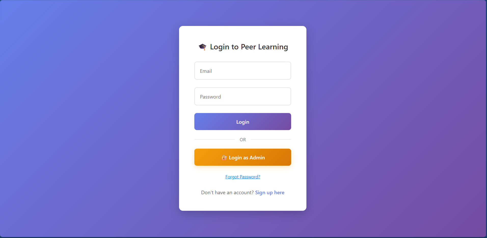
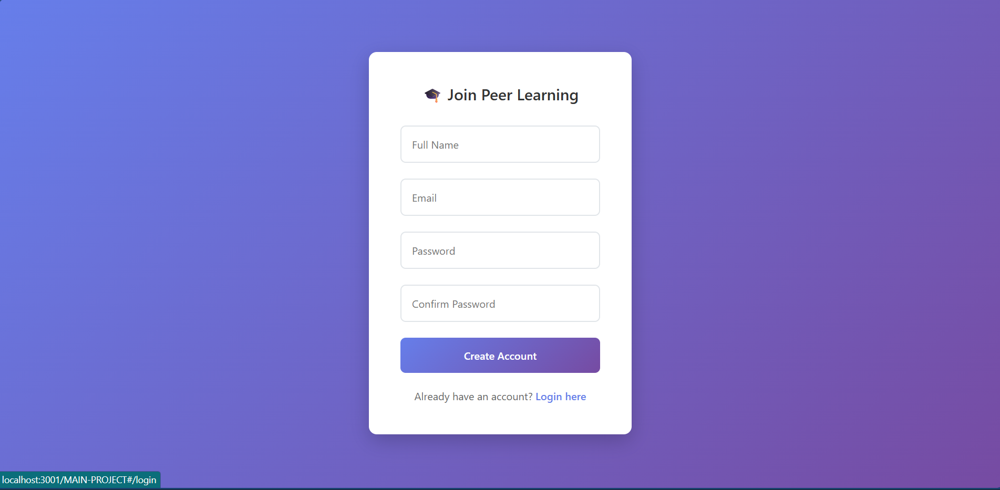
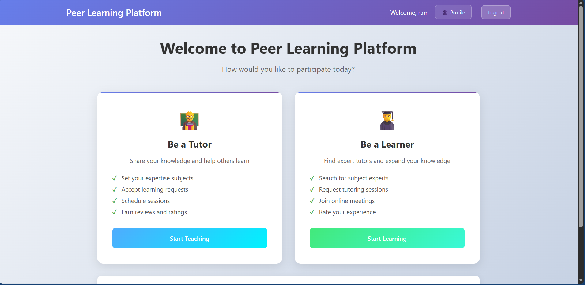
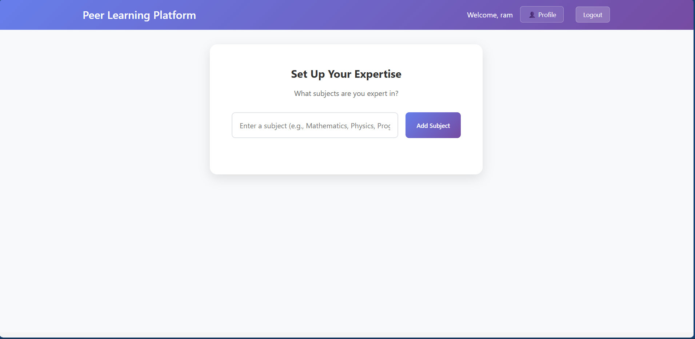
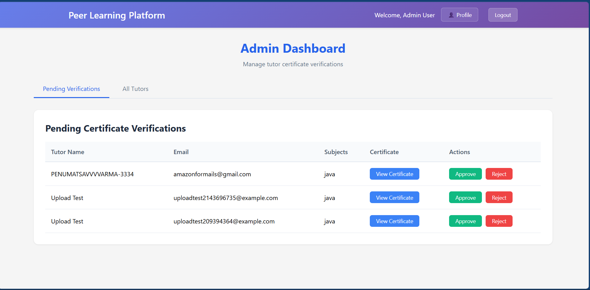
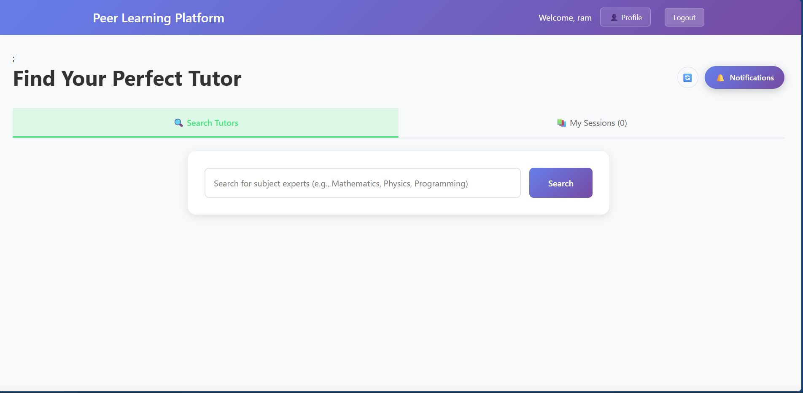

# MERN Stack Social Platform# Peer-to-Peer Learning Platform


A full-stack social networking platform built with MongoDB, Express.js, React, and Node.js featuring real-time messaging, authentication, and user interactions.A MERN stack application for connecting learners with tutors in real-time.


## ✨ Features## Features


- **User Authentication**: Secure JWT-based authentication with email verification### For Learners:

- **Real-time Chat**: Socket.io powered messaging system- 🔍 Search for online tutors by subject

- **User Profiles**: Complete profile management with bio, location, and profile pictures- 📝 Send tutoring requests

- **Post Management**: Create, edit, delete posts with image support- 🔔 Receive notifications

- **Social Features**: Friend requests, likes, comments, and notifications- ⭐ Rate and review tutors

- **Search Functionality**: Find users and posts with advanced search- 📊 Mandatory review system (must review before requesting new tutors)

- **Responsive Design**: Mobile-friendly interface

### For Tutors:

## 🚀 Quick Start- 📚 Set subject expertise

- 🟢 Toggle online/offline status

### Prerequisites- 📮 Receive and manage tutoring requests

- Node.js (v14 or higher)- 📧 Automatic Google Meet link generation

- MongoDB- 📈 Track ratings and reviews

- npm or yarn

### General Features:

### Installation- 🔐 User authentication (Register/Login)

- 🎭 Role selection (Tutor/Learner)

1. **Clone the repository**- 🔔 Real-time notifications

   ```bash- 📧 Email notifications

   git clone <repository-url>- 📱 Responsive design

   cd complete-project-by-using-mern

   ```## Tech Stack


2. **Install dependencies**- **Frontend**: React.js, CSS3, Socket.IO Client

   ```bash- **Backend**: Node.js, Express.js, Socket.IO

   # Install server dependencies- **Database**: MongoDB with Mongoose

   npm install- **Authentication**: JWT (JSON Web Tokens)

   - **Email**: Nodemailer

   # Install client dependencies- **Real-time**: Socket.IO

   cd client

   npm install## Getting Started

   cd ..

   ```### Prerequisites

- Node.js (v14 or higher)

3. **Environment Setup**- MongoDB (local installation or MongoDB Atlas)

   Create a `.env` file in the root directory:- Gmail account (for email notifications)

   ```env

   PORT=5000### Installation

   MONGODB_URI=mongodb://localhost:27017/social-platform

   JWT_SECRET=your-jwt-secret1. **Clone and Setup:**

   EMAIL_USER=your-email@gmail.com   ```bash

   EMAIL_PASS=your-app-password   cd "complete project by using mern"

   ```   npm install

   cd client

4. **Start the application**   npm install

   ```bash   ```

   # Development mode (runs both client and server)

   npm run dev2. **Environment Configuration:**

      Create a `.env` file in the root directory:

   # Or start separately:   ```env

   # Server only   MONGODB_URI=mongodb://localhost:27017/peer-learning

   npm start   JWT_SECRET=your-super-secret-jwt-key-change-this-in-production

      EMAIL_USER=your-email@gmail.com

   # Client only (in client directory)   EMAIL_PASS=your-app-password

   cd client && npm start   PORT=5000

   ```   ```


5. **Access the application**3. **Start MongoDB:**

   - Frontend: http://localhost:3000   Make sure MongoDB is running on your system.

   - Backend API: http://localhost:5000

4. **Run the Application:**

## 📁 Project Structure   

   **Backend Server:**

```   ```bash

├── client/                 # React frontend   npm run dev

│   ├── public/   ```

│   ├── src/   Server will run on http://localhost:5000

│   │   ├── components/     # React components

│   │   ├── pages/         # Page components   **Frontend (new terminal):**

│   │   ├── services/      # API services   ```bash

│   │   └── styles/        # CSS styles   cd client

│   └── package.json   npm start

├── src/                    # Backend source code   ```

│   ├── config/            # Configuration files   React app will run on http://localhost:3000

│   ├── controllers/       # Route controllers

│   ├── middleware/        # Custom middleware## Usage Guide

│   ├── models/            # Database models

│   ├── routes/            # API routes### 1. Registration & Login

│   ├── services/          # Business logic- Go to http://localhost:3000

│   └── utils/             # Utility functions- Register with your name, email, and password

├── uploads/               # File uploads- Login with your credentials

├── app.js                 # Express app setup

└── package.json

```#### As a Tutor:

1. Click "Be a Tutor" from the dashboard

## 🛠️ Technologies Used2. Set your subject expertise (e.g., Mathematics, Physics, Programming)

3. Toggle your online status to receive requests

### Backend4. Accept/reject incoming requests

- **Node.js** - Runtime environment5. Google Meet links are automatically generated and emailed

- **Express.js** - Web framework

- **MongoDB** - Database#### As a Learner:

- **Mongoose** - ODM1. Click "Be a Learner" from the dashboard

- **Socket.io** - Real-time communication2. Search for tutors by subject

- **JWT** - Authentication3. Send requests to online tutors

- **bcrypt** - Password hashing4. Join sessions via Google Meet links

- **Multer** - File uploads5. **Important**: You must review completed sessions before requesting new tutors

- **Nodemailer** - Email service

### 3. Notifications

### Frontend- Click the notification bell to see real-time updates

- **React** - UI library- Get notified about requests, acceptances, and reviews

- **Axios** - HTTP client

- **Socket.io-client** - Real-time client### 4. Review System

- **CSS3** - Styling- After each session, learners must provide ratings (1-5 stars)

- **JavaScript (ES6+)** - Programming language- Reviews help other learners choose quality tutors

- Mandatory review system prevents spam requests

## 📚 API Documentation

## API Endpoints

### Authentication Endpoints

- `POST /api/auth/register` - User registration### Authentication

- `POST /api/auth/login` - User login- `POST /api/register` - User registration

- `POST /api/auth/verify-email` - Email verification- `POST /api/login` - User login

- `POST /api/auth/forgot-password` - Password reset

### User Management

### User Endpoints- `PUT /api/user/role` - Update user role and subjects

- `GET /api/users/profile` - Get user profile- `PUT /api/tutor/online` - Toggle tutor online status

- `PUT /api/users/profile` - Update profile

- `GET /api/users/search` - Search users### Tutor Discovery

- `GET /api/tutors/search/:subject` - Search online tutors by subject

### Post Endpoints

- `GET /api/posts` - Get all posts### Request Management

- `POST /api/posts` - Create new post- `POST /api/request` - Send tutoring request

- `PUT /api/posts/:id` - Update post- `GET /api/tutor/requests` - Get tutor's pending requests

- `DELETE /api/posts/:id` - Delete post- `PUT /api/request/:id/respond` - Accept/reject request

- `PUT /api/request/:id/complete` - Mark session as completed

### Social Endpoints

- `POST /api/social/friend-request` - Send friend request### Reviews

- `POST /api/social/like` - Like/unlike post- `POST /api/review` - Submit session review

- `POST /api/social/comment` - Add comment- `GET /api/user/pending-reviews` - Get sessions needing review

- `GET /api/tutor/:id/reviews` - Get tutor's reviews

## 🔧 Development

### Notifications

### Available Scripts- `GET /api/notifications` - Get user notifications

- `npm start` - Start production server- `PUT /api/notifications/:id/read` - Mark notification as read

- `npm run dev` - Start development server with hot reload

- `npm test` - Run tests## Database Schema

- `npm run build` - Build for production

### User

### Contributing```javascript

1. Fork the repository{

2. Create a feature branch  name: String,

3. Commit your changes  email: String (unique),

4. Push to the branch  password: String (hashed),

5. Open a Pull Request  role: 'tutor' | 'learner',

  subjects: [String],

## 📄 License  isOnline: Boolean,

  rating: Number,

This project is licensed under the MIT License.  reviewCount: Number

}

## 👥 Support```


For support and questions, please open an issue in the repository.### Request

```javascript

---{

  learner: ObjectId,

**Built with ❤️ using the MERN Stack**  tutor: ObjectId,
  subject: String,
  status: 'pending' | 'accepted' | 'rejected' | 'completed',
  meetLink: String,
  sessionDate: Date
}
```

### Review
```javascript
{
  request: ObjectId,
  learner: ObjectId,
  tutor: ObjectId,
  rating: Number (1-5),
  comment: String
}
```

### Notification
```javascript
{
  user: ObjectId,
  message: String,
  type: 'request' | 'acceptance' | 'review' | 'general',
  isRead: Boolean
}
```

## Key Features Implemented

### 1. Mandatory Review System
- Learners cannot search for new tutors until they review completed sessions
- Prevents spam and ensures quality feedback

### 2. Real-time Notifications
- Socket.IO integration for instant notifications
- Notification bar with unread count

### 3. WebRTC Video Calling
- Peer-to-peer video calling with WebRTC
- Auto-start when tutor accepts request
- Audio/video controls and end call

### 4. Smart Tutor Discovery
- Only shows online tutors
- Subject-based filtering
- Rating and review display

### 5. Role-based Interface
- Dynamic UI based on user role
- Separate tutor and learner dashboards

## Troubleshooting

### Common Issues

1. **MongoDB Connection Error:**
   - Ensure MongoDB is running
   - Check the connection string in `.env`

2. **Email Not Sending:**
   - Use Gmail App Passwords (not regular password)
   - Enable 2-factor authentication on Gmail
   - Update EMAIL_USER and EMAIL_PASS in `.env`

3. **CORS Errors:**
   - Backend runs on port 5000, frontend on 3000
   - CORS is configured for localhost:3000

4. **Socket Connection Issues:**
   - Ensure both servers are running
   - Check browser console for connection errors

## Future Enhancements

- Video chat integration (replace Google Meet with in-app video)
- Payment system for paid tutoring
- Tutor scheduling system
- Advanced search filters
- Mobile app development
- Chat system for communication

## Contributing

1. Fork the repository
2. Create a feature branch
3. Make your changes
4. Test thoroughly
5. Submit a pull request

## License

This project is licensed under the MIT License.

---

## 📸 Screenshots

### 🔐 Login Page


### 📝 Signup Page


### 🧑‍🎓 User Dashboard


### 👨‍🏫 Tutor Dashboard


### 🛠 Admin Dashboard


### 📚 Learner Page


**Happy Learning! 🎓📚**
